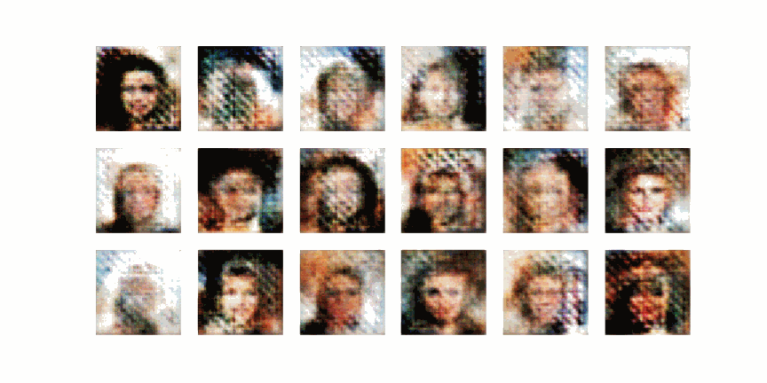
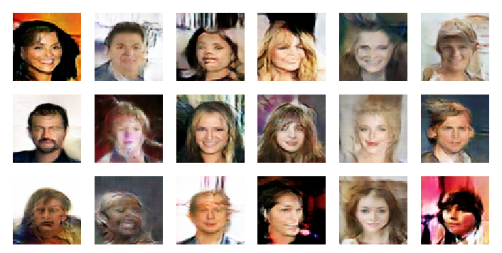
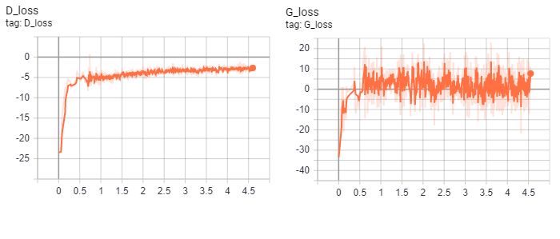

# WGAN-GP Tensorflow 2.0

This repo is the TF2.0 implementation of [Improved Training of Wasserstein GANs](https://arxiv.org/abs/1704.00028). 

Note that this implementation is not totally the same as the paper. There might be some differences.

## Dataset

The notebook trains WGAN-GP using aligned [CelebA](http://mmlab.ie.cuhk.edu.hk/projects/CelebA.html) dataset, the image resolution is adjusted to 64*64. Due to the limitation of computation resource, I train the models for only 40 epochs. It may be able to produce better images if trained for more epochs. 

## How to Run

There are two ways to run this repo.

*   1. Download the dataset you want.

    2. Clone this repo, then use Juypter Notebook or Lab to open the `WGAN-GP-celeb64.ipynb`     file, and modify the dataset path in the **Prepare dataset** section.

* Run in Google Colab [:smiley_cat:](https://colab.research.google.com/drive/12nvXHacUtAsaoh3uN9uK-QXXIP_JD7uh)

(In the default setting, training one epoch would take about 300~500 seconds.)

## Results

Result at 40 epoch

Training losses (Did not multiply negative)

## Acknowledges

Ishaan Gulrajani, Faruk Ahmed, Martin Arjovsky, Vincent Dumoulin, and Aaron Courville, "Improved Training of Wasserstein GANs", https://arxiv.org/abs/1704.00028

Alec Radford, Luke Metz, Soumith Chintala, "Unsupervised Representation Learning with Deep Convolutional Generative Adversarial Networks", https://arxiv.org/abs/1511.06434

TKarras's PGGAN repository, https://github.com/tkarras/progressive_growing_of_gans